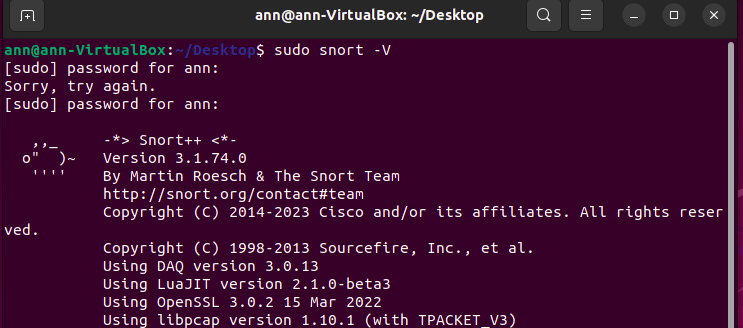

# Detecting-Network-Attacks-Using-Snort-3-Integrated-with-Wazuh-SIEM

## Objective
This project demonstrates how to integrate Snort 3 IDS with Wazuh SIEM to detect and forward alerts in real time.  
By simulating ICMP pings and TCP port scans from a host machine, Snort was configured to generate alerts, which were then ingested into the Wazuh dashboard for centralized monitoring.

## Skills Learned
- Installation and configuration of Snort 3 with custom detection rules.
- Integration of Snort alerts into Wazuh for centralized SIEM monitoring.
- Simulation of network attacks (ICMP pings and TCP port scans) for detection testing.
- Parsing and verification of real-time alerts in the Wazuh dashboard.
- Hands-on experience in IDS rule creation, log forwarding, and SIEM alert correlation.

## Tools Used
- Snort 3
- Wazuh OVA
- Ubuntu VM
- Linux Host Machine
- Nmap

## Steps
Step 1: Installed and Configured Snort 3
I Installed Snort 3 on Ubuntu VM with the required dependencies. verified the installation using: sudo snort -V

  

Next, I Added custom rules in local.rules:
alert icmp any any -> any any (msg:"ICMP Ping Detected"; sid:1000001;)
alert tcp any any -> any any (flags:S; msg:"Port scan attempt"; sid:1000002;)

  

Step 2: I configured Ubuntu as Wazuh Agent
Installed & registered the Wazuh agent.
Verified active status in the Wazuh dashboard.

  

  

Step 3: I Ran Snort  
    sudo snort -c /usr/local/etc/snort/snort.lua -R /usr/local/etc/rules/local.rules -i enp0s3

  

Step 4: I launched Port Scan and ICMP Pings. From my host linux machine, I pinged my ubuntu machine and ran an nmap scan. 

  

Snort successfully detected the traffic and logged it to: alert_fast.txt

  

Step 5: Forwarded Logs to Wazuh
I Edited ossec.conf to forward Snort logs and restarted Wazuh agent.

   

Step 6: Verified Alerts in Wazuh Dashboard
I confirmed Snort alerts displayed in the Wazuh SIEM interface.

  
    
  

## Conclusion
This project demonstrated how Snort 3 can be integrated with Wazuh SIEM to detect and monitor network attacks in real time. The custom rules successfully identified ICMP pings and TCP port scans, with alerts forwarded to the Wazuh dashboard.

